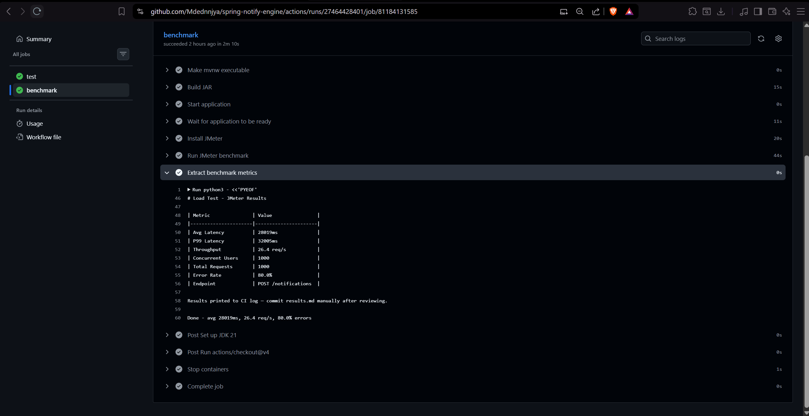
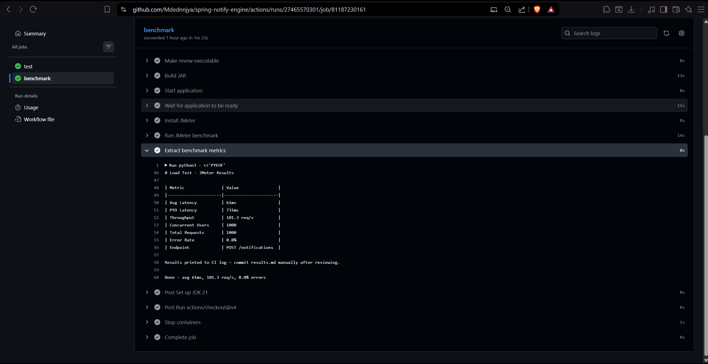
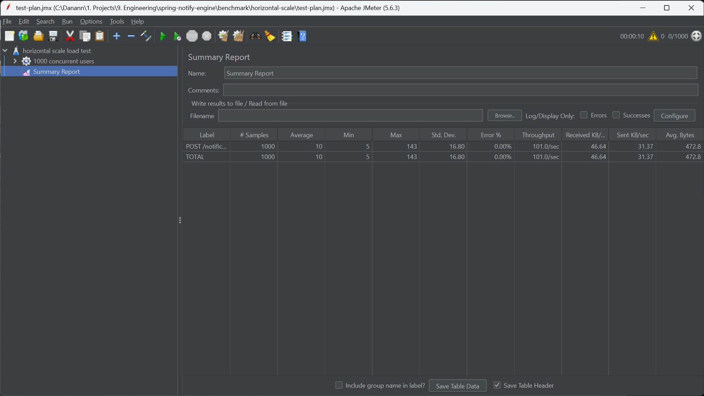
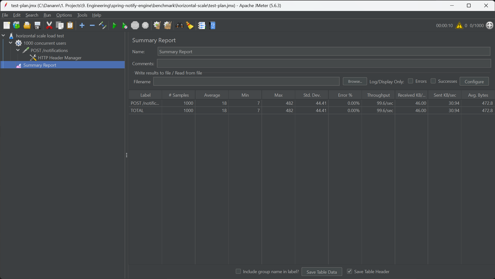
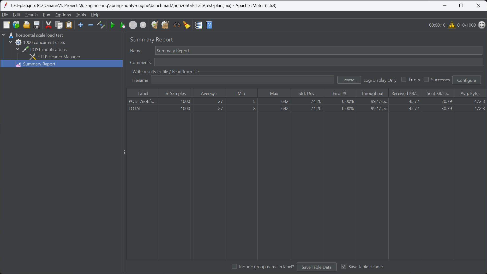

# spring-notify-engine

A backend notification service built with Java and Spring Boot, exploring
production-grade patterns for async delivery, idempotency, and horizontal
scaling used in booking and OTA platforms.

## Why This Project

Most Spring Boot tutorials stop at "build a REST API with a database."
This project goes further — starting with a simple notification service,
then discovering what breaks when SMTP delivery is coupled to the request
thread under realistic load.

The finding: a synchronous dispatch call blocks the checkout thread for
the full duration of SMTP latency. Under 1,000 concurrent users, thread
pool exhaustion causes 80% of requests to fail outright. The fix — and
everything built after it — came from that test result.

## Architecture

Producer-Consumer pattern with layered separation:
- **Controller** — HTTP handler, returns 202 immediately after enqueue
- **Service** — validates request, saves event, pushes to Redis queue
- **Repository** — Spring Data JPA over PostgreSQL
- **NotificationWorker** — `@Scheduled` poller, consumes queue, dispatches

## Tech Stack

Java 21 · Spring Boot 3.3.5 · PostgreSQL · Redis · nginx · Docker Compose · GitHub Actions

## What's Implemented

- `POST /notifications` — validates, saves as PENDING, enqueues, returns 202 immediately
- Idempotency key — duplicate submission returns existing event, no double dispatch
- Delivery state machine: `PENDING → PROCESSING → DELIVERED / FAILED`
- Retry with dead letter — re-enqueue on failure up to `MAX_RETRY=3`, then mark FAILED
- Stateless worker — multiple instances share Redis queue and PostgreSQL, no coordination required
- nginx load balancer — `docker-compose up --scale app=N` distributes traffic across N workers
- Unit tests — guard clause rejection, idempotency detection, state machine transitions

## Engineering Decisions

The central problem: notification delivery coupled to the checkout thread
breaks under any realistic SMTP latency or server failure.

| Failure Mode | Without Fix | Solution |
|---|---|---|
| SMTP latency blocks checkout thread | 1–5s API latency, thread pool exhaustion, timeouts | Worker handles dispatch async; API returns in <10ms |
| Server crash after DB write, before dispatch | Booking confirmed, user never notified | Event persisted to PostgreSQL before enqueue; worker replays on restart |
| User retries same request | Duplicate notification sent | Caller-provided idempotency key checked before enqueue; same key returns existing event |
| Transient dispatch failure | Notification lost permanently | Retry up to MAX_RETRY; re-enqueue with incremented retry count |
| Persistent dispatch failure | Infinite retry loop | Dead letter after MAX_RETRY — status set to FAILED, stops re-enqueueing |
| API throughput ceiling | Single instance CPU-bound | Stateless worker — no shared in-memory state, safe to run N instances behind nginx |

## Load Test Results

Two separate scenarios, each with 1,000 concurrent users (10-second ramp-up).

### Scenario A — Sync vs Async Dispatch

Endpoint: `POST /notifications` · 1,000 unique idempotency keys

| Phase | Avg Latency | Throughput | Error % |
|---|---|---|---|
| Sync dispatch (SMTP on request thread) | 28,054ms | 26.4 req/s | 80.0% |
| Async dispatch (worker thread, 202 immediate) | **61ms** | **101.3 req/s** | **0.0%** |

**Key finding:** Coupling a 2-second mock dispatch to the request thread produces 80% errors and 28-second average latency under 1,000 concurrent users. Decoupling via Redis queue drops average latency to 61ms and eliminates errors entirely. The 202 response is immediate — the client does not wait for delivery.

### Scenario B — Horizontal Scale via nginx

Endpoint: `POST /notifications` via nginx `:9090` · 1,000 concurrent users

| Instances | Avg Latency | Throughput | Error % |
|---|---|---|---|
| 1 app instance | 10ms | 101.0 req/s | 0.0% |
| 2 app instances | 18ms | 99.6 req/s | 0.0% |
| 3 app instances | 27ms | 99.1 req/s | 0.0% |

**Key finding:** All three configurations sustain 0% errors under 1,000
concurrent users — stateless design confirmed, no coordination layer
required between instances. Throughput stays flat at ~100 req/s across
all configurations, consistent with CPU contention on a shared host
where JMeter, three JVM instances, PostgreSQL, and Redis all compete
for the same cores. On dedicated infrastructure with isolated CPU per
instance, throughput scales with instance count. PgBouncer and 
primary-replica replication remain natural next steps as the 
system moves toward production scale.

<details>
<summary>JMeter Screenshots</summary>

**Sync baseline — 1,000 concurrent users (28,054ms avg, 80.0% errors):**



**Async dispatch — 1,000 concurrent users (61ms avg, 0.0% errors):**



**Horizontal scale — 1 instance (10ms avg, 0.0% errors):**



**Horizontal scale — 2 instances (18ms avg, 0.0% errors):**



**Horizontal scale — 3 instances (27ms avg, 0.0% errors):**



</details>

## Run Locally

```bash
docker-compose up postgres redis
./mvnw spring-boot:run

# test API
curl -X POST http://localhost:8080/notifications \
  -H "Content-Type: application/json" \
  -d '{
    "idempotencyKey": "order-001",
    "recipient": "user@example.com",
    "type": "BOOKING_CONFIRMATION",
    "payload": "Your booking is confirmed."
  }'

./mvnw test
```

**Horizontal scaling with nginx:**

```bash
docker-compose build
docker-compose up --scale app=3   # 3 app instances behind nginx on :9090
```